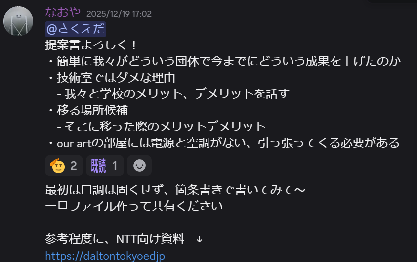

# はじめに

やあ （´・ω・｀)

ここを読んでいるということは、何らかの原因であなたはマネジメントを任されているはず。

ここではマネジメントをするときや、人に物事を任せるとき、交渉をするときにどういう風に進めるといいかどうかを書いておきます。
私がやってよかったこと、こうした方がよかったかも、ということを混ぜて書いているので、全てを実行した訳ではありません。ご了承まで。

# マネジメントって何？

**チームの成果を最大化するための役割**[らしい](https://qiita.com/kyntk/items/f5731a68e6aed10e3639)。  
今までの弊チームは、リーダー（マネージャー）がチームメンバーをまとめて、設計を考えて、車を作って、仕事を振って...とほとんどの業務を担っていました。  
このことを**作業の属人化**といいます。  

これが一概に悪いことかと言われたらそうではなくて、チーム創成期など時にはカリスマ的役割の必要な時期もあります。  
ただ、巡航期に入ったチームは一般的に、ある人がいなくなってもチームが回るように仕事の振り方を設計するのが望ましいと言われています。  
これのことを、**冗長性**といいます。  

この冗長性をいかに作っていくか、自分（マネージャー）がいかに楽をする（仕事を人に任せる）か、がマネージャーの仕事となっていくわけです。  

## マネージャーって誰さ

難しい話です。多分常時マネージャーとして動くのは代表（プロジェクト・マネージャー）。副代表はその補佐をやったり、手伝いをやったり、時にはちゃんとマネージャーをやらなければいけない。  
各班代表も立派なマネージャーです。各班に位置するメンバーをまとめ、仕事を割り振り、やる気を奮い立たせるという役割を得ます。  

そういう代表だとか名前の付いた役職を持っていないメンバーたちも、マネージャーになることがあります。
特に複数人で作業をするときは、マネージャーが最低1人できます。  

いざフレームを設計しよう！となったときにも、フレーム全体をいきなり設計することはできません。  
4輪にするか3輪にするかを考える人、アッカーマンをどうするか考える人、サスペンションをどうするか考える人...等、ちゃんと役割分担をしないととてもじゃないけどやってられないです。  

なので、これは代表とか副代表だけの話ではなく、チームメンバー全員に影響しうる（可能性のある）話なんです。  

# 仕事の頼み方

なんと、マネジメントとは仕事の頼み方である。ちゃんと仕事を頼めるようになったら一流のマネージャーだ。

## どう仕事を頼むべきか？

実は答えがない。というか、私もよくわかっていない。  
外的要因に寄りすぎて、最適解がない....としか言いようがない  
とはいえ、ある程度はテンプレがあるとおもうので書いてみる。  

>[任せるタスク]をやってほしいです！  
>・ここに条件や事前情報を箇条書き1  
>・ここに条件や事前情報を箇条書き2  
>・ここに条件や事前情報を箇条書き3  
>・ここに条件や事前情報を箇条書き4  
>・ここに条件や事前情報を箇条書き5  
>3割程度できたらいったん見せてください！  
>参考資料（あれば）

条件や事前情報の例はこんな感じ。

# チームを持ったらどうする？

チームをもしあなたが持ったと仮定しよう。もしかしたらすでに持っているかもしれないが。
まず、やるべきはチームメンバーのことを知ること。
一般的に、チームメンバーを知るためには1on1というものをすることが多い。

## 1on1とは

その名の通り、1対1でMTGをすること。
他のチームメンバの好きなことや特性などを知るのに活用すると望ましいです。

## どんなことを聞くべきか？

ごめんなさい！！！まだオレよくわかってないんでggったものを載せます！！！
>・2週間前と比べて、この2週間の心身の健康はどうですか？
>・2週間前と比べて、この2週間はより楽しかったですか？
>・2週間前と比べて、この2週間で成長できたと感じますか？
<small>引用: https://qiita.com/sugulu_Ogawa_ISID/items/41cd1866ca4cf3e29615</small>
